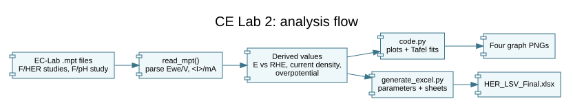

# CE Lab 2: hydrogen-evolution data

Experimental electrochemistry data and Python analysis for hydrogen-evolution reaction (HER) measurements. The repo contains EC-Lab `.mpt` exports for platinum, bare stainless steel, and modified stainless steel, plus plotting scripts, generated PNG graphs, and Excel workbooks.

## Generate the outputs

Use Python 3 and install the libraries used by the two scripts:

```sh
python3 -m pip install pandas numpy matplotlib openpyxl
python3 code.py
python3 generate_excel.py
```

Run these commands from the repository root; the scripts read fixed relative paths under `F/`. `code.py` writes four plot PNGs, comparing potential/current density and Tafel fits. `generate_excel.py` writes `HER_LSV_Final.xlsx` with data sheets, scatter charts, and summary values. It overwrites that workbook, so save a copy first if you have edited it. The other committed workbook and plots are existing outputs.

Both scripts hard-code an electrode area of 0.65973 cm², pH 14, a Hg/HgO reference (with an Ag/AgCl option), and a Tafel fitting window. Review those assumptions and the input files before using the calculated onset potential, current-density values, Tafel slope, or exchange current density in a report. The code does not provide a general command-line interface or automated tests.

## Analysis flow


